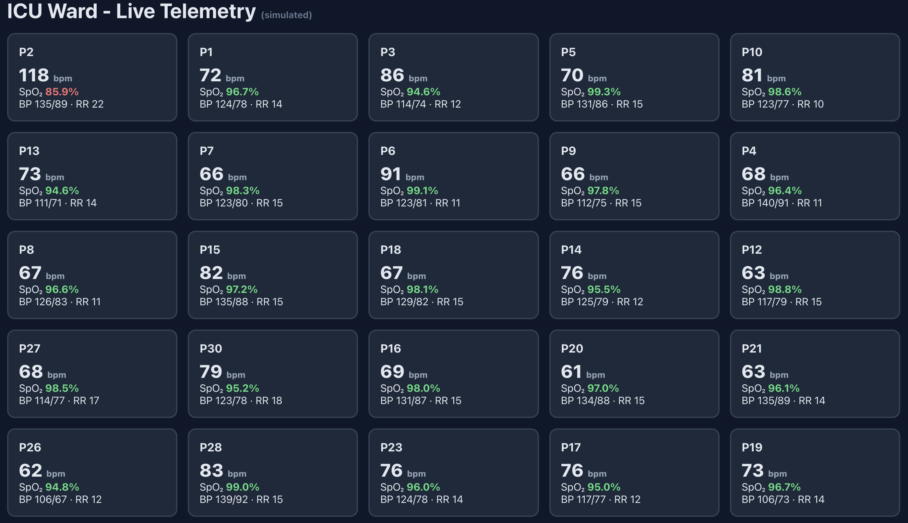

# ICU Telemetry & Alerting Platform *(simulated)*

Real-time patient monitoring pipeline: simulated ICU vitals stream through Kafka into time-series
storage while a detection engine watches for deterioration - fixed clinical thresholds plus
per-patient statistical baselines, and pushes prioritized alerts to a live ward dashboard.

> **Disclaimer:** All patient data is synthetic. Educational project - not a medical device,
> not for clinical use.



## Architecture

```
 Simulator (30 patients, 1Hz)
      │  POST /readings
      ▼
 Ingest API (FastAPI, asyncio) ── validates, stamps, publishes
      │
      ▼
 Kafka topic "vitals" (Redpanda, 3 partitions, keyed by patient)
      │
      ├────────────► Writer (consumer group: writer) ──► PostgreSQL
      │
      └────────────► Alert Engine (group: alerts) ──► alerts table
                          │                        └─► Redis pub/sub
                          ▼
                  WebSocket service (group: ws) ◄── Redis "alerts"
                          │
                          ▼
                  React dashboard (live tiles + alert feed)
```

Three independent consumer groups read the same stream: storage, detection, and fan-out
scale and fail independently.

## Quickstart

```bash
docker compose up -d                                  # Postgres, Redis, Redpanda
python -m venv .venv && source .venv/bin/activate
python -m pip install -r requirements.txt

# five processes (separate terminals):
uvicorn services.ingest.main:app --port 8000
python services/writer/writer.py
python services/alerts/engine.py
uvicorn services.ws.server:app --port 8001
python services/simulator/simulator.py

cd dashboard && npm install && npm run dev            # open http://localhost:5173
```

Patient **p2** begins a scripted deterioration (SpO₂ ↓, HR ↑) 90 seconds after the simulator
starts — watch the dashboard catch it in stages.

## Design decisions

**Why Kafka between ingest and processing?** Decoupling: the API acknowledges at broker-ack and
consumers process at their own pace. Verified by killing the writer mid-stream — readings
accumulate in the topic and replay completely on restart. Zero loss.

**Why per-patient baselines?** 74 bpm is normal for one patient and alarming for another. The
engine keeps a rolling 60-reading window per patient per vital and alerts on deviation from
*that patient's* normal — catching trends before universal thresholds trip.

**Tuning the trend detector (a false-alarm story).** The first version used |z| ≥ 3.0 and fired
constantly on healthy patients — 3σ on Gaussian noise trips ~0.3% of readings, which at 1Hz
across a ward is an alarm every few seconds: alert fatigue, the exact failure mode real ICU
alarms suffer. Fixes: raised to 4.5σ, required a full baseline window before judging, and made
checks directional (only rising HR / falling SpO₂ alarm — SpO₂ of 99% is not an emergency).
Result: silent on healthy patients, clean escalation on the scripted event.

**Alert fatigue controls.** Per-(patient, rule) cooldown (30s) paces repeat alerts; the dashboard
deduplicates idempotently on (time, patient, rule) — consumers must tolerate at-least-once
delivery.

**Ordering.** Kafka messages are keyed by patient_id, so each patient's readings stay in order
within a partition — required for windowed statistics to be meaningful.

## Measured performance

k6 saturation ladder against the ingest path (single uvicorn process, ack-per-request to Kafka,
Apple Silicon laptop, Docker):

| target rate | achieved | p50 | p95 | failures |
|---|---|---|---|---|
| 500/s | 499/s | 8.9 ms | 91 ms | 0% |
| 1000/s | 990/s | 145 ms | 276 ms | 0% |
| 2000/s | 938/s (saturated) | 509 ms | 2.01 s | 0% |

Sustained ceiling ≈ **1,000 readings/sec with zero request failures** — beyond it the system
queues rather than drops (durability over throughput: ack-per-request was a deliberate choice;
batching or multiple workers would raise the ceiling at the cost of loss semantics).
End-to-end alert latency (reading → detection → dashboard) is sub-second at nominal load.

## Roadmap (v2)

- ML anomaly detection: scikit-learn model trained on simulator ground truth, served as a
  parallel consumer; evaluated against the statistical baseline
- TimescaleDB hypertables + continuous aggregates for history queries
- Kubernetes deployment, HPA on the alert engine; Prometheus/Grafana (consumer lag, latency)
- Alert acknowledgment flow + escalation policies

## Stack

Python (FastAPI, asyncio, aiokafka) · Kafka via Redpanda · PostgreSQL · Redis ·
React + TypeScript (Vite) · WebSockets · k6 · Docker Compose